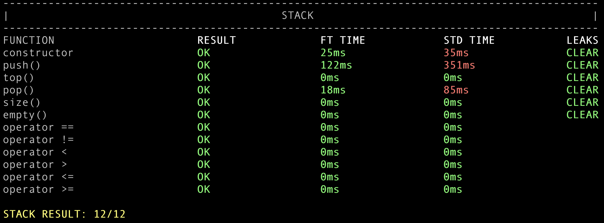
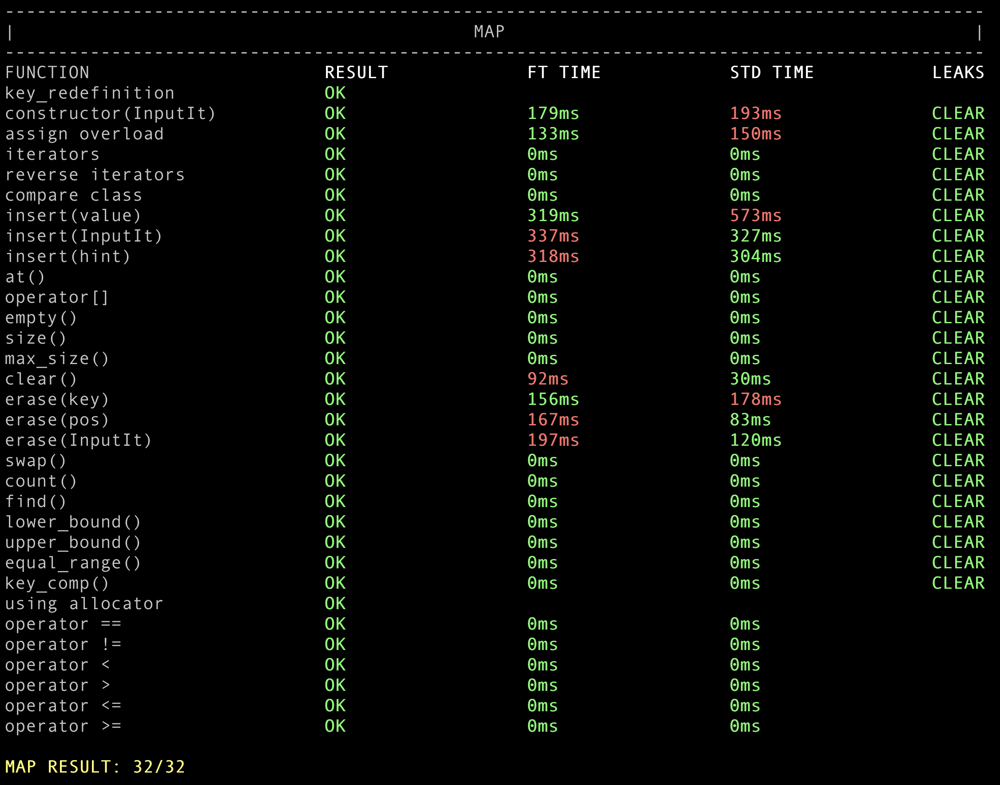

# 42Cursus FT_CONTAINER

## C++의 컨테이너를 직접 구현해보기

이 프로젝트는 C++의 STL(Standard Template Library) 컨테이너들을 직접 구현해 보는 것이 목표입니다. Vector, Utilities, Stack 그리고 Map을 직접 만들어 보며, C++에 대한 이해도를 향상시키고, 알고리즘 및 자료구조에 대한 지식을 확장하게 됩니다. 또한, 템플릿 프로그래밍을 실제로 해보면서 해당 내용에 대한 확실한 이해를 할 수 있습니다.

## 컨테이너들에 대한 설명

### Vector

Vector는 동적 배열을 구현한 컨테이너입니다. 배열의 크기를 미리 지정할 필요가 없고, 요소를 추가할 때 자동으로 공간을 확장합니다. 이 Vector 구현체는 STL의 vector와 동일한 API를 제공합니다. 내부적으로는 연속된 메모리 공간을 할당하며, 필요시 새로운 메모리 공간에 요소를 복사하고, 기존의 메모리 공간을 해제하는 방식으로 공간을 확장합니다.

### Utilities

Utilities는 컨테이너와 관련된 유틸리티 함수들을 모아놓은 곳입니다. Pair, Less 등 STL에서 제공하는 필수적인 함수들을 포함하고 있습니다. Pair는 두 요소를 하나의 쌍으로 묶어줍니다. 이는 Map에서 Key-Value 쌍을 저장하거나, 여러 함수에서 여러 반환 값들을 처리하는 등의 용도로 사용됩니다. Less는 두 요소를 비교하는 함수로, 주로 정렬이나 순서 유지 등의 용도로 사용됩니다.

### Stack

Stack은 LIFO(Last In First Out) 방식의 자료구조를 구현한 컨테이너입니다. 마지막에 들어온 요소가 먼저 나가는 특성을 가집니다. 이 Stack 구현체는 STL의 stack과 동일한 API를 제공합니다. 내부적으로는 Vector, Deque 또는 List와 같은 다른 컨테이너를 사용하여 요소를 저장하며, Top, Push, Pop 등의 주요 연산을 제공합니다.

### Map

Map은 Key-Value 쌍을 저장하는 자료구조를 구현한 컨테이너입니다. Key는 유일하며, Key를 통해 빠르게 Value에 접근할 수 있습니다. 이 Map 구현체는 STL의 map과 동일한 API를 제공합니다. 내부적으로는 보통 레드-블랙 트리와 같은 균형 이진 탐색 트리를 사용하여 요소를 저장하며, 이를 통해 log(n) 시간 복잡도로 요소를 탐색할 수 있습니다.

## Project Reflections

C++에서 제공하는 컨테이너를 직접구현함으로써, C++ 자료구조들의 내부구조를 확실하게 알 수 있었습니다.

또한 컨테이너를 구현하면서 얻을 수 있었던 가장 큰 장점은 '템플릿 프로그래밍을 어떻게 하는지를 알 수 있는 것'이었습니다.

이번 과제를 통해서, 기존에는 어렴풋하게 알고있었던 템플릿 프로그래밍에 대해 확실하게 알 수 있었고, 상위언어에서도 해당 개념이 어떻게 적용되는지 알 수 있었습니다.
